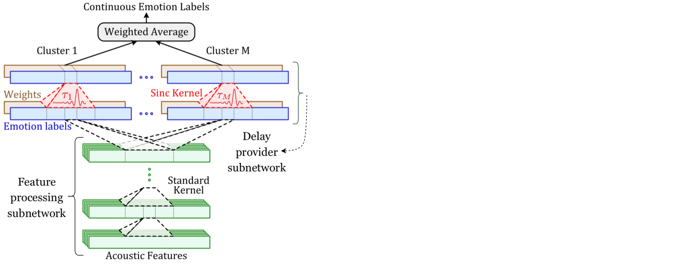

.. -*- mode: rst -*-

MDS-network
===========

Multi-delay sinc (MDS) network for predicting continuous emotion annotations from speech signal

What is this repository?
------------------------

This repository contains a python project that can be used to replicate the experiments of the paper [1]. This paper introduces a new convolutional neural network (multi-delay sinc network). The network is able to simultaneously align and predict labels in an end-to-end manner. As it can be seen in the above figure, the network is a stack of convolutional layers followed by an aligner sub-network that aligns the speech signal and emotion labels. This aligner sub-network is implemented using a new convolutional layer that we introduce, the delayed sinc layer. It is a time-shifted low-pass (sinc) filter that uses a gradient-based algorithm to learn a single delay. Multiple delayed sinc layers can be used to compensate for a non-stationary delay that is a function of the acoustic space. 

How to run it?
--------------

Khorram S., McInnis M., Provost E. M., “Jointly Aligning and Predicting Continuous Emotion Annotations”, IEEE Transactions on Affective Computing, 2019.

Each run file is provided to replicate one experiment of the paper. Please feel free to contact me (Soheil Khorram), if you have any question regarding the current implementation.
